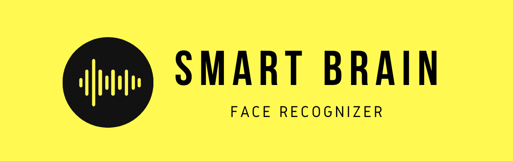

# <div align='center'>💡 Smart Brain App</div>

<div align='center'>
<p>
    <p>
    <a href="https://smart-brain-claire.herokuapp.com/"></a>
    

</p>
<p>
A face recognition app that uses the Clarifai API to detect and locate a human face in the picture.

A full-fledged app with user registration and login system. Frontend built with React.js, backend server and APIs with Node.js & Express.js, and PostgresSQL as database to keep track of how many entries a user has made. Deployed on Heroku.

</p>
<p><strong><a href="https://smart-brain-claire.herokuapp.com/">
Click here for Live demo</a></strong>
</p>

</div>

## 📕 How to Use the App

- Sign Up / Log In
- Input an image url and click detect button
- The app detects the face in the picture and highlight it with a blue bounding box.

## ✨ Features

- A complete user registration system
- Modern & Responsive UI, particle background effects created with Particle.js library
- Separate frontend and backend, easy modifications

## ⚙️ Installation

From your command line, first clone the project:

### Clone this repository

```zsh
$ git clone https://github.com/clairepeng0808/smart-brain-app

Go into the repository
$ cd smart-brain-app

# Remove current origin repository
$ git remote remove origin
```

### Install the dependencies

```zsh
# Install dependencies
$ npm install

# Start dev development server
$ npm run dev
```

After installation, open [http://localhost:3000](http://localhost:3000) to view it in the browser. You can clone the [backend repo here](https://github.com/clairepeng0808/smart-brain-api)

### Changed the API URLs

Original

```zsh
fetch("https://radiant-forest-01776.herokuapp.com/imageurl", {
      method: "POST",
      headers: { "Content-Type": "application/json" },
      body: JSON.stringify({
        input: this.state.input,
      }),
    })
```

If your backend is running on port 3001, changed your code to:

```zsh
fetch("http://localhost:3001/imageurl", {
      method: "POST",
      headers: { "Content-Type": "application/json" },
      body: JSON.stringify({
        input: this.state.input,
      }),
    })
```

### New Build

```zsh
$ npm run start
```

### Deploy to Heroku

Please Refer to the [official document](https://devcenter.heroku.com/articles/git#tracking-your-app-in-git)

## 🤟 Languages

<div>


</div>

## 🛠️ Technologies

### APIs

- [Clarifai API](https://www.clarifai.com/models/face-detection) - Predict api to tell what is in your images, videos or text. Capture data about the physical world through images.

- [Smart Brain API](https://github.com/clairepeng0808/smart-brain-api) - Smart Brain API endpoints.

### NPM Packages

- [Material UI](https://material-ui.com/getting-started/installation/) - React UI framework
- [particles.js](https://vincentgarreau.com/particles.js/) - Lightweight JS library for creating particles.
- [serve](https://www.npmjs.com/package/serve) - for serving a single page app or static files
- [jQuery](https://www.npmjs.com/package/jquery) - to include jQuery in the project

## 💎 Credits

This project is a clone of one of the projects [Smart Brain](https://github.com/aneagoie/smart-brain) in the course: **The Complete Web Developer in 2020**. Thanks for the support from the instructor [Andrei](https://github.com/aneagoie) and the [ZTM community](https://github.com/zero-to-mastery).

## 📚 License


